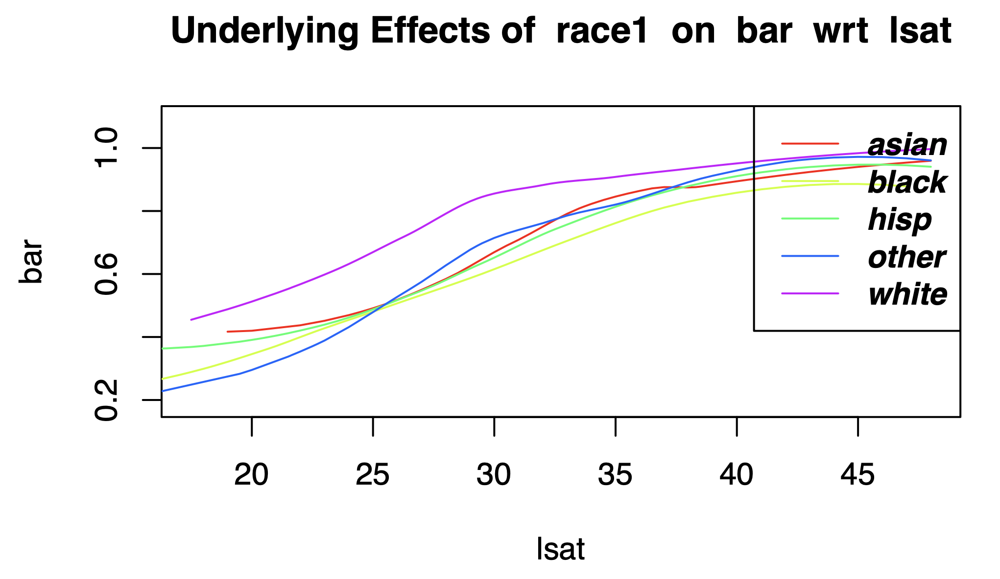

---
title: "Quick Start"
output:
   rmarkdown::html_vignette
vignette: >
  %\VignetteIndexEntry{Quick Start}
  %\VignetteEngine{knitr::rmarkdown}
  \usepackage[utf8]{inputenc}
---

```{r, include = FALSE}
knitr::opts_chunk$set(
  collapse = TRUE,
  comment = "#>"
)
```


# The dsld Package: Data Science Looks at  Discrimination

</br>
</br>

# What this package is about

Discrimination, be it racial, gender, age or whatever, is often a major
topic, and a natural application of Data Science. This package consists of
graphical/tabular and analytical methods toward this end.

The package enables analysis of two quite different aspects of discrimination
involving a sensitive variable S, an outcome variable Y, and a vector of
covariates X:

* The classical issue: Are two individuals, identical in all respects X,
  treated differently in terms of S? For instance, do men and women of
  the same education, occupation and age (X) have the same mean for wage
  Y?

* Fairness in machine learning (ML): Say we are using an ML method,
  ranging from ordinary linear regression modeling to deep learning, to
  predict a variable Y from variables X. We are concerned that that
  prediction may be influenced by a sensitive variable S.  A credit
  institution, say, may wish to predict whether a loan would be repaid,
  Y, based on various credit numbers X for the applicant. We hope to
  eliminate or at least greatly reduce the influence of sensitive
  variables S such as race and gender.

# Form of the package

Many of the functions in the package are wrappers for functions in
base-R, **qeML** and other packages, with the wrappers adding
discrimination analysis-specific features. For example, **dsldLinear**
wraps the standard R linear model function **lm** (via **qeLin**), but
adds dummy variables for the levels of the sensitive variable S, and
forms standard errors for their difference in conditional mean Y.  It
also allows the user to specify that interaction terms between X and S
be included.  If say S is race, this enables comparison between Black
and white, Black and Hispanic and so on, at specified X values.

Care has been taken to design a uniform interface to **dsld** functions.
In most cases, the first three arguments are 

* **data**, a data frame, data
table or tibble 

* **yName**, the name of the column containing the
response variable Y 

* **sName**, specifying the name of the column 
corresponding to the sensitive variable S

Most analytical functions are paired with generic **predict**
functions, and in some cases with generic **plot**.

# Analytical operations

## Treatment comparison in the presence of confounders

Consider the dataset **lsa**, built into **qeML**, a modified version of
the dataset **law.school.admissions** that is a common example in ML
circles. 

Running

``` r
data(lsa)
names(lsa)
#  [1] "age"      "decile1"  "decile3"  "fam_inc"  "lsat"     "ugpa"
#  [7] "gender"   "race1"    "cluster"  "fulltime" "bar"

```

shows the predictors as consisting of age, two decile scores for first-
and third-year law school grades, and so on. (This is of course an
observational dataset.  While there may be methodological
issues---possible collider effect, "predicting" the past etc.--here we
are simply demonstrating the software.)

We'll take Y to be LSAT score, with S being race. There has been concern
that the LSAT and other similar tests are biased against Black and
Latino students, and might otherwise have racial issues. Let’s
investigate, using **dsld**, trying a linear model.

``` r
z <- dsldLinear(lsa,'lsat','race1')
summary(z)
# $`Summary Coefficients`
#      Covariate    Estimate StandardError       PValue
# 1  (Intercept) 31.98578856   0.448435264 0.000000e+00
# 2          age  0.02082458   0.005841758 3.641634e-04
# 3      decile1  0.12754812   0.020946536 1.134602e-09
# 4      decile3  0.21495015   0.020918737 0.000000e+00
# 5      fam_inc  0.30085804   0.035953051 0.000000e+00
# 6         ugpa -0.27817274   0.080430542 5.430993e-04
# 7   gendermale  0.51377385   0.060037102 0.000000e+00
# 8   race1black -4.74826307   0.198088318 0.000000e+00
# 9    race1hisp -2.00145969   0.203504412 0.000000e+00
# 10  race1other -0.86803104   0.262528590 9.449471e-04
# 11  race1white  1.24708760   0.154627086 6.661338e-16
# 12    cluster2 -5.10668358   0.119798362 0.000000e+00
# 13    cluster3 -2.43613709   0.074744210 0.000000e+00
# 14    cluster4  1.21094567   0.088478368 0.000000e+00
# 15    cluster5  3.79427535   0.124476695 0.000000e+00
# 16    cluster6 -5.53216090   0.210750853 0.000000e+00
# 17   fulltime2 -1.38882076   0.116212777 0.000000e+00
# 18     barTRUE  1.74973262   0.102818692 0.000000e+00
# 
# $`Sensitive Factor Level Comparisons`
#    Factors Compared Estimates Standard Errors      P-Value
# 1     asian - black  4.748263       0.1980883 0.000000e+00
# 2      asian - hisp  2.001460       0.2035044 0.000000e+00
# 3     asian - other  0.868031       0.2625286 9.449471e-04
# 4     asian - white -1.247088       0.1546271 6.661338e-16
# 5      black - hisp -2.746803       0.1863750 0.000000e+00
# 6     black - other -3.880232       0.2515488 0.000000e+00
# 7     black - white -5.995351       0.1409991 0.000000e+00
# 8      hisp - other -1.133429       0.2562971 9.764506e-06
# 9      hisp - white -3.248547       0.1457509 0.000000e+00
# 10    other - white -2.115119       0.2194472 0.000000e+00
```

So again, Y is the LSAT score, S is race and the X variables are the
remaining columns.  Note that factor variables have been converted (by
**lm**, called from **dsldLinear**) to dummies such as **race1black**.  

As can be seen above, we can use the generic **summary** function to
inspect coefficients and other output. (The call is dispatched to
**summary.dsldLM**.) Again, note that much of the information here is
specific to discrimination issues, reflecting the fact that **dsld**
wrappers enhance output with discrimination-related material.

Let's look at two variables in particular, **fam_inc** and
**race1black**, whose estimated coefficients are 0.3009 and -4.7483,
respectively, with standard errors of about 0.0360 and 0.1981.  

Family income here is reported in quintiles, i.e. it takes on the values
1,2,3,4,5. We see that the difference between, say, the 3rd and 4th
quintiles in terms of mean LSAT is about 0.3 point. That's minuscule in
view of the fact that LSAT scores in this dataset ranged from 11 to 48
points. 

By contrast, being African-American (relative to the default, which
happens to be Asian here) accounts for a mean difference of nearly 5
points.

This is of interest in a couple of aspects. First, though test scores do tend
to be correlated with family income and indeed that 0.3009 number is
statistically significant -- p-value 0 to six figures -- its practical
significance is very small.  

Second, the data suggest that even African-Americans from, say, middle
class families fare relatively poorly on the LSAT.  This does not
necessarily imply that there is "something wrong" with the LSAT, but it
does call for more detailed analysis.

What about Black vs. white scores?  We see that the difference in dummy
variables for Black and white scores is about 6.0000 points with a
standard error of 0.1410. The other differences are reported as well.

This is another example of the extra capabilities that **dsldLinear**
adds to the base-R **lm**. While the standard errors for the racial
differences could be derived by applying R's **vcov** function to the
output of **lm**, this would require background the distribution of
linear combinations of random variables, something many users do not
have; **dsld** provides it automatically.

## Fair prediction

The setting of interest, as mentioned, is that in which we wish to
predict Y from X while limiting the influence of S. Note the word
*limiting*; we generally cannot fully limit the impact of S, due to
*proxies*, variables that are correlated with S yet which we need to
achieve reasonable predictive accuracy. This leads to the
the Fairness/Utility Tradeoff: The more we emphasize fairness, i.e. the
smaller the role we allow S and the proxies to play in predicting Y, the
lesser our utility, i.e. predictive accuracy.

Many methods have been proposed for dealing with this tradeoff, some of
which are included in the package. Here is an example using the
**dsldFgrrm** function, a wrapper for a function in the **fairml**
package. It consists of a modified logistic model, with a LASSO-style
shrinking mechanism that limits the effect of S. The degree of limitation
is specified by the **unfairness** argument, a value in (0,1]; smaller
values mean more fairness.

The **compas** dataset involves the COMPAS software package, a
commercial product used by judges to help decide sentences given to
convicted criminals. It address the question, "How likely is this person
to commit another crime, say in the next two years?"

Some have claimed that the algorithm is biased against certain racial
minorities. The dataset allows us to explore alternatives, say a simple
logit model with limitations on S.

``` r
data(compas)
names(compas)
#  [1] "age"             "juv_fel_count"   "decile_score"    "juv_misd_count" 
#  [5] "juv_other_count" "v_decile_score"  "priors_count"    "sex"            
#  [9] "two_year_recid"  "race"            "c_jail_in"       "c_jail_out"     
# [13] "c_offense_date"  "screening_date"  "in_custody"      "out_custody"    
cmps <- compas[,c('age','juv_fel_count','juv_misd_count',
   'priors_count','sex','two_year_recid','race')]
head(cmps)
  age juv_fel_count juv_misd_count priors_count    sex two_year_recid
1  69             0              0            0   Male             No
2  34             0              0            0   Male            Yes
3  24             0              0            4   Male            Yes
6  44             0              0            0   Male             No
7  41             0              0           14   Male            Yes
9  39             0              0            0 Female             No
              race
1            Other
2 African-American
3 African-American
6            Other
7        Caucasian
9        Caucasian

```

First, let's run the code with **unfairness = 1**, no attempt at all the
reduce the impact of S. We'll try predicting whether someone like the
second person in the dataset will recidivate.

``` r
z100 <- dsldFgrrm(cmps,'two_year_recid','race',1)
predict(z100,cmps[2,-6])
# [1] 0.3756553
```

The logit analysis estimates a probability of about 37%.

Now let's try setting **unfairness = 0.10**.

``` r
z010 <- dsldFgrrm(cmps,'two_year_recid','race',0.10)
predict(z010,cmps[2,-6])
# [1] 0.3244952
```

Now limiting the effect of this person's race -- he is African-American
-- the probability reduces to 32%.

# Graphical/tabular operations

The package includes an extensive set of functions for graphical and
tabular operations. 

*dsldConditDisparity example*

For instance, continuing the law school example, consider the code

``` r
dsldConditDisparity(lsa,'bar','race1','lsat')
```

We will graph the relation between bar passage and the LSAT, by race.

{width=50%}

Notably, all the nonwhite groups exhibited similar outcomes. However,
all the groups, both white and nonwhite, converge at the higher LSAT
score. 

*dsldFrequencyByS example*

As another example, consider the **svcensus** file included with the
package, which consists of some year 2000 census data for programmers
and engineers in Silicon Valley.

``` r
data(svcensus)
names(svcensus)
# [1] "age"     "educ"    "occ"     "wageinc" "wkswrkd" "gender" 
```

Say we are interested in investigating possible wage discrimination in
wages. We may, for example, suspect that education is a confounder.
Let's take a look, using the **dsldConfounders** function.

``` r
dsldFrequencyByS(svcensus, cName = "educ", sName = "gender")
#        Frequency of zzzOther Frequency of 14 Frequency of 16
# female             0.2068052      0.02098615       0.7722086
# male               0.2177579      0.04110130       0.7411408
```

(Codes 14 and 16 are for Master's and PhD, respectively.)

No, men and women seem to have very similar patterns of education. 

How about occupation?  There are six occupational codes.

``` r
dsldFrequencyByS(svcensus, cName = "occ", sName = "gender")
#$        Frequency of 102 Frequency of 101 Frequency of 100 Frequency of 141
#$ female        0.3117359        0.2349226        0.3274246       0.04258354
#$ male          0.2016862        0.2203267        0.3433671       0.01923330
#$        Frequency of 140 Frequency of 106
#$ female       0.02587612       0.05745721
#$ male         0.04446055       0.17092610
```

Here there seems to be a substantial gender difference. But does it
matter? Let's see how wages vary by occupation.

``` r
tapply(svcensus$wageinc,svcensus$occ,mean)
#      100      101      102      106      140      141 
# 50396.47 51373.53 68797.72 53639.86 67019.26 69494.44 
```

Yes, there is quite a bit of variation.  So, we might consider treating
occupation as a confounder but not education.

*dsldFreqParCoord example*

It is always difficult to visualize in more than two dimensions. One
technique for doing this is *parallel coordinates*. 

Say our dataset has p columns. Each column will correspond to one
vertical section in our graph.  For each row of data, we draw polygonal
line horizontally, with the height at vertical section i equal to the
value of variable i for that row. (Typically we center and scale each
variable.)

So, each row forms a pattern.  The function **dsldFreqParCoord**
displays the m most commonly-appearing patterns from each level of S.
(Two patterns are treated as equal if they are near each other in a
k-nearest neighbor sense; k is an argument to the function.)

Here we try it on the **lsa** data, with m = 75:

``` r
data(lsa)
lsa1 <- lsa[,c('fam_inc','ugpa','gender','lsat','race1')]
dsldFreqPCoord(lsa1,75,'race1')
```

{width=50%}

Some interesting aspects arise:

* Black students showed the least variation. The most common pattern was
  that of a female student from a slightly below-average income family,
  low undergraduate grades, and very low LSAT scores.

* The typical patterns for whites was almost the mirror image of Blacks,
  though with gender diversity. Asians were similar.

* Hispanics showed a wide variety of income levels and grades, but low
  LSAT scores.

*dsldTakeALookAround example*

In Fair ML applications, we wish to find a subset C of the columns of X
that is a "sweet spot" in the Fairness/Utility Tradeoff.  The function
**dsldTakeALookAround** can be helpful in this regard. It has a 3-column
output:

* Column (a): accuracy of C in predicting Y.

* Column (b): accuracy of C,S in predicting Y.

* Column (c): accuracy of C in predicting S.

Here accuracy is mean absolute prediction error for numeric Y, overall
misclassification rate for binary/categorical Y.

Except for sampling variation, (b) should be greater than (c), but if
the difference is small, it says that C can stand on its own, not
needing S -- i.e. good Utility. We wish (c) to be small, in that it
suggests that C does not contain proxies.

``` r
data(svcensus)
dsldTakeALookAround(svcensus, 'wageinc', 'gender', 4)
#           Feature Names        a        b     c
# 1                   age 32947.19 30873.18 0.237
# 2                  educ 31047.38 30125.06 0.221
# 3                   occ 32078.79 29177.58 0.229
# 4               wkswrkd 26037.21 26058.17 0.261
# 5              age,educ 31217.78 31711.95 0.233
# 6               age,occ 29932.83 32332.44 0.234
# 7           age,wkswrkd 27469.78 26000.03 0.243
# 8              educ,occ 29997.97 32611.99 0.276
# 9          educ,wkswrkd 25470.76 28206.85 0.266
# 10          occ,wkswrkd 26735.07 25138.36 0.253
# 11         age,educ,occ 30972.33 28336.55 0.245
# 12     age,educ,wkswrkd 26365.74 25159.97 0.224
# 13      age,occ,wkswrkd 26893.18 26487.06 0.266
# 14     educ,occ,wkswrkd 27039.72 26353.69 0.226
# 15 age,educ,occ,wkswrkd 25278.55 25474.90 0.250
```

For instance, the predictor set age, educ and wkswrkd seems good.

# Python interface

Many **dsld** functions have Python interfaces. See the **.py** files in
**inst/Python**. The user's machine must have the Python libraries
**pandas** and **rpy2** installed, the latter serving to translate
Python calls to R calls.

We note that the code should be considered "beta."

Below is an example, run from the Python interactive REPL ('>>>' prompt),
the latter running in **inst/Python**. We fit a linear model and run
**summary**.

```
import rpy2.robjects as robjects
from dsldLinear_Py_R import dsldPyLinear, dsldPyDiffS, dsldPyLinearSummary

robjects.r['data']('svcensus')
robjects.r('svcensus$occ <- as.factor(svcensus$occ)')
robjects.r('svcensus$gender <- as.factor(svcensus$gender)')
robjects.r('svcensus$educ <- as.factor(svcensus$educ)')
data = robjects.r['svcensus'] 

dsldLinRObject = dsldPyLinear(data, 'wageinc', 'gender')
dsldPyLinearSummary(dsldLinRObject)

```


# Associated textbook

The package is paired with a [free Quarto
textbook](https://htmlpreview.github.io/?https://github.com/matloff/dsldBook/blob/main/_book/index.html).
The book is not an extended user manual for the package; instead, it is
a presentation of the underlying concepts, using the package to
illustrate those concepts.,

# Full function list, by category

Type **vignette('Function_List')**.

