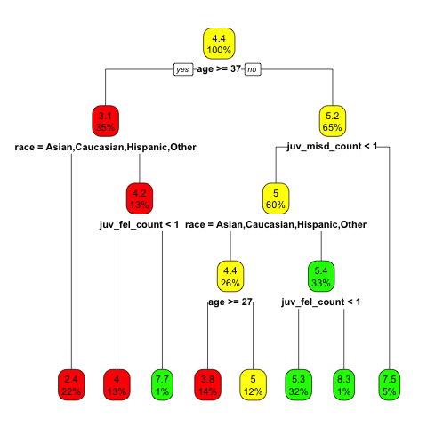

# Data Science Looks at Discrimination

## A toolkit for investigating bias regarding race, gender, age and so on.

<!---
library(fairml)
compasRpart <- rpart(decile_score ~ .,compas[,-c(6,7,9,13,14)])
rpart.plot(compasRpart,,box.palette=c('red','yellow','green'))
--->

## Overview

Discrimination is one of the key social issues, in the US and in a
number of other countries.  There is lots of available data with which
one might investigate possible discrimination.  But how might such
investigations be conducted?

Our **dsld** package provides both graphical and analytical tools
for this purpose.  We see it as widely applicable; here are just a few
use cases:

* Quantitative analysis in instruction and research social science courses.

* Corporate HR analysis and research.

* Litigation involving discrimination and related issues.

* Concerned citizenry. 

## Prerequisite background

In addition to having installed R, the user should have a very basic
knowledge of statistical inference--mean, variance, confidence intervals
and tests, and histograms.  A "bare bones" refresher, with emphasis on
intuition, is given in Appendix A.

## Introduction and motivating examples

To set the stage, consider the following:

* UC Berkeley was accused of discriminating against female applicants
  for graduate school, and indeed the overall acceptance rate for women
was lower than that for men.  However, upon breaking the data down
according to the program students were applying to, it was found that in
every department, the female acceptance rate *within that department*
was either higher than the male rate or of similar value.  The problem:
women were applying to more selective programs, causing their overall
rate to below that of men.

* The **pef** dataset, included here in the **dsld** package, is a
  subset of US census data from back in 2000, focusing on six
engineering occupations.  The question at hand is whether there is a
gender pay gap.  Again, the overall pay for men is higher, by about 25%.
But what if we break things down by occupation?  Though it does turn out
that some occupations pay more than others, and that men and women are
not distributed evenly among the occupations, there still is a gender
pay gap, of about 16%.

In both examples, we have an outcome variable Y of interest--acceptance
rate and wage income--and a sensitive variable S, which was gender in
both examples.  But in both cases, were concerned that merely comparing
mean Y for each gender was an oversimplication, due to a possible
*confounder* C--department in the first example, occupation in the
second.  Failure to take into account confounders (there can be more
than one, and usually are so) can lead to spurious "relations" between S
and Y.  Let's refer to such problems as *accounting for confounders,*
or *adjusting for confounders*; or more succinctly, since these are
classical statistics applications, we'll just refer to them as
*statistics problems.*.

Now consider a different kind of example.

* COMPAS is a commercial machine learning software tool for aiding
  judges in to predict recidivism by those convicted of crimes.  A 2016
[**Pro Publica**
article](https://www.propublica.org/article/machine-bias-risk-assessments-in-criminal-sentencing)
investigated, finding  the tool to be racially biased; African-American
defendants tended to be given harsher ratings--i.e. higher estimated
probabilities of recidivism--than similarly situated white defendants.
Assuming that to be the case (which the firm Northpointe that developed
COMPAS denies), how can the analysis be fixed?  A key point is that any
remedy must not only avoid using race directly, but must also minimize
the impact of variables O that are separate from race but still correlated
with it, known as *proxies*.  If, say, educational attainment is
correlated with race, its inclusion in our analysis will mean that race
is still playing a role in our analysis after all.  We wish to predict
Y, without using S, and making only limited use of the O variables.

This example falls in the category of *fairness in machine learning ML*.

Note the difference between accounting for confounders on the one hand,
and fair ML on the other.  Here is a side-by-side comparison:

<table border="1">

   <tr>
   <th>aspect</th>
   <th>statistics</th>
   <th>fair ML</th>
   </tr>

   <tr>
   <td>goal</td>
   <td>estimate effects of S</td>
   <td>predict an outcome Y</td>
   </tr>

   <tr>
   <td>sensitive variables S</td>
   <td>include S</td>
   <td>exclude S</td>
   </tr>

   <tr>
   <td>form of remedy</td>
   <td>adjust for confounders C</td>
   <td>use proxies O but limit their impact</td>
   </tr>

</table>

## Format of this tutorial

We treat the topics in this order:

* adjusting for confounders

* fair ML

Within each of the above topic, we cover:

* graphical and tabular exploration

* formal quantitative analysis

In each case, we present explanations of the relevant concepts, so that
this is a general tutorial on methodology for analysis of
discrimination, and show the details of using our **dsld** package to
make use of that methodology.

